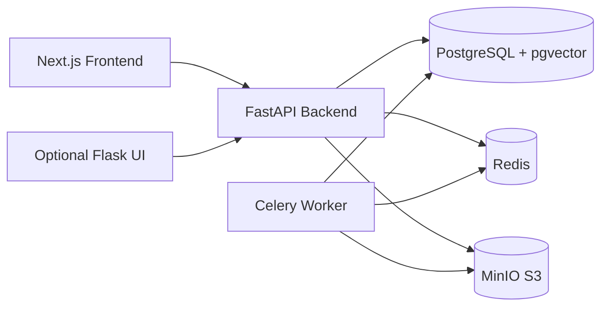

# DocIntelli - AI-Powered Document Intelligence Platform

DocIntelli is a production-style document AI system for ingestion, extraction, search, RAG Q&A, and agent workflows.
It combines FastAPI, PostgreSQL + pgvector, Celery, Redis, MinIO, and Gemini.

## Highlights

- Upload and process `PDF`, `DOCX`, `TXT`, `CSV`, and `Excel` documents
- Hybrid search (`semantic + keyword + rerank`) across document chunks
- Grounded RAG chat with source-aware answers and streaming
- Structured extraction and document classification workflows
- ReAct-style agent workflows (comparison, summarization, research)
- Async processing pipeline with Celery workers
- Docker-first development setup

## Architecture



## Tech Stack

| Layer | Stack |
|---|---|
| API | FastAPI, Pydantic v2, SQLAlchemy |
| Search/RAG | pgvector, tsvector, sentence-transformers, cross-encoder reranker |
| Queue | Celery + Redis |
| Storage | MinIO (S3-compatible) |
| LLM | Google Gemini |
| Frontend | Next.js 14, React 18 |
| Optional UI | Flask + Jinja templates |
| ML/Fine-tuning | PEFT/QLoRA toolchain in `ml/` |

## Quick Start (Docker)

### 1) Prerequisites

- Docker Desktop (or Docker Engine + Compose v2)
- Gemini API key

### 2) Configure environment

Create `.env` from template:

```bash
cp .env.example .env
```

On Windows PowerShell:

```powershell
Copy-Item .env.example .env
```

Then edit `.env` and set at minimum:

```env
GEMINI_API_KEY=your-key-here
```

### 3) Start all services

```bash
docker compose up --build
```

Services started by `docker-compose.yml`:

- `postgres` on `5432`
- `redis` on `6379`
- `minio` on `9000` (console `9001`)
- `backend` on `8000`
- `celery-worker`
- `frontend` on `3000`

### 4) Run database migrations

```bash
docker compose exec backend alembic upgrade head
```

### 5) Verify everything

- Frontend: `http://localhost:3000`
- API docs: `http://localhost:8000/docs`
- API health: `http://localhost:8000/health`
- API v1 health: `http://localhost:8000/api/v1/health`
- MinIO console: `http://localhost:9001` (`minioadmin` / `minioadmin123`)

## First API Calls

### Upload document

```bash
curl -X POST http://localhost:8000/api/v1/documents/upload \
  -F "file=@invoice.pdf"
```

### Search

```bash
curl -X POST http://localhost:8000/api/v1/search \
  -H "Content-Type: application/json" \
  -d '{"query":"payment terms","top_k":5}'
```

### Ask RAG chat

```bash
curl -X POST http://localhost:8000/api/v1/chat \
  -H "Content-Type: application/json" \
  -d '{"query":"Summarize key payment obligations"}'
```

### Run an agent workflow

```bash
curl -X POST http://localhost:8000/api/v1/agents/run \
  -H "Content-Type: application/json" \
  -d '{"workflow":"research_assistant","params":{"research_question":"What payment terms appear across all contracts?"}}'
```

## Local Development (Without Full Docker)

### Start infra only

```bash
docker compose up -d postgres redis minio
```

### Backend

```bash
cd backend
pip install -e ".[dev]"
uvicorn app.main:app --reload --port 8000
```

### Celery worker

```bash
cd backend
celery -A app.tasks.celery_app worker --loglevel=info
```

### Frontend

```bash
cd frontend
npm install
npm run dev
```

### Optional Flask dashboard UI

```bash
python flask_app.py
```

By default it runs on `http://localhost:5000` and proxies to `http://localhost:8000/api/v1`.

## Testing

```bash
cd backend
pytest tests -v
```

## Project Structure

```text
doc-intelli/
|-- backend/            # FastAPI app, business logic, agents, tasks
|-- frontend/           # Next.js frontend
|-- ml/                 # Training / evaluation scripts
|-- templates/          # Flask/Jinja templates (optional UI)
|-- scripts/            # Utility scripts
|-- docker-compose.yml
|-- flask_app.py        # Optional Flask UI proxy
`-- .env.example
```

## Optional ML Workflows

ML scripts are available under `ml/classification` and `ml/fine_tuning` for classifier training and QLoRA experiments.

## Troubleshooting

- `backend` fails on startup: ensure `.env` has a valid `GEMINI_API_KEY`.
- `alembic` errors: verify `postgres` is healthy and then rerun migration.
- slow first run: model downloads for embeddings/reranker can take time.
- upload/processing stuck: check `celery-worker` logs.

## Security Notes

- Never commit real secrets in `.env`.
- Rotate API keys immediately if they were exposed.
- Replace default MinIO credentials in non-local environments.

## Author

Ali Haider - [alihaider.live](https://alihaider.live)
